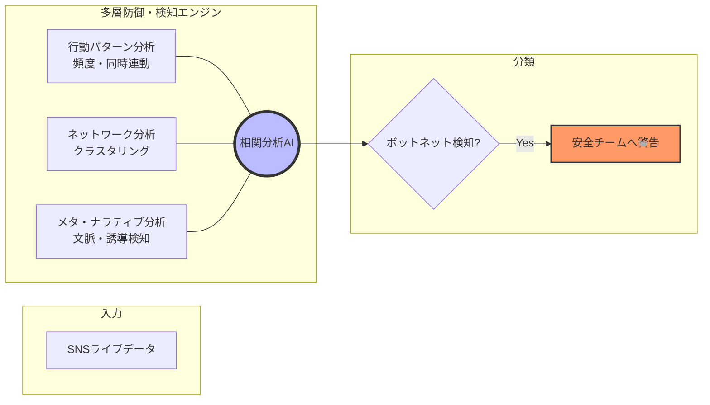

# 問六⑴ Bot検知手法の設計：画像生成用プロンプト（日本語版）

このYAMLブロックを、画像生成AI（DALL-E 3、Midjourney等）に入力して、「Bot検知フロー概要図」を作成してください。**図内のテキストは日本語にするよう厳密に指示しています。**

```yaml
target_image:
  subject: "A professional system architecture flowchart for '多層的なAIボット検知システム'"
  style: "Clean, modern, corporate technical diagram, high contrast, minimalist icons"
  layout: "Horizontal flow from left to right"
  language: "Japanese (Mandatory: All labels must be in Japanese)"

flow_labels:
  input: "SNSライブデータ (投稿・メタデータ)"
  layer_title: "多層防御・検知エンジン"
  layer_a: "行動パターン分析 (投稿頻度・同時性)"
  layer_b: "ネットワーク構造分析 (クラスタ解析)"
  layer_c: "メタ・ナラティブ分析 (文脈矛盾・誘導検知)"
  engine: "相関分析AIエンジン"
  output: "悪性ボットネットの検知・警告"

visual_elements:
  colors: "Cybersecurity Blue, Neural Network Teal, Warning Red for detected botnets"
  icons: "Data stream, magnifying glass, cluster nodes, warning shield"
  background: "Pure white for clarity"

technical_directives:
  - "Write all text in clear, legible Japanese characters"
  - "Use professional fonts for labels"
  - "Ensure arrows show a logical flow from Data Input to Final Detection"
  - "The central detection area should show the three analysis layers working together"
```

---

### 💡 確実な図表作成（Mermaidコード：日本語版）
画像生成AIで文字が崩れる場合は、こちらの日本語化済みMermaidコードを[Mermaid Live Editor](https://mermaid.live/)等で使用してください。


