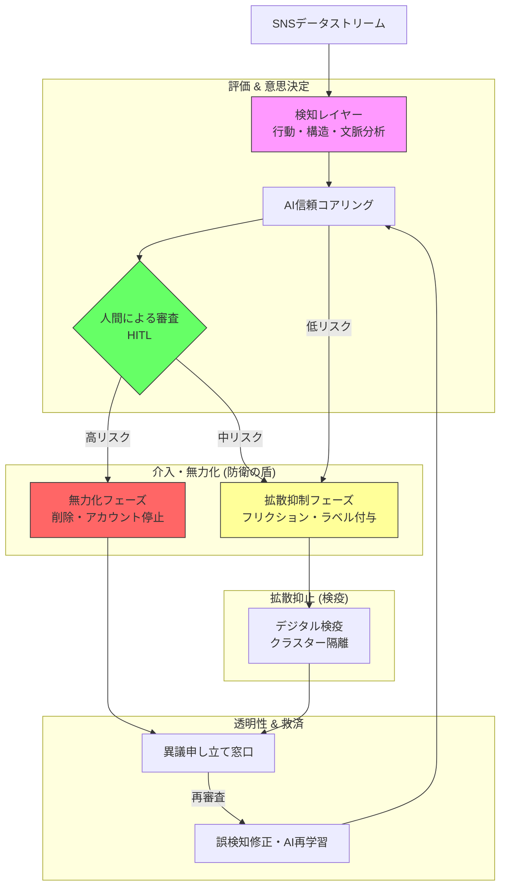

# 問六⑵ 防衛アーキテクチャ：画像生成用プロンプト

このYAMLブロックを、画像生成AI（DALL-E 3、Midjourney等）に入力して、「防衛アーキテクチャ図」を作成してください。図内のラベルが日本語になるよう指定しています。

```yaml
target_image:
  subject: "A professional system architecture diagram for 'AI世論操作に対する多層防衛アーキテクチャ'"
  style: "Clean, modern, cybersecurity framework diagram, minimalist icons, high readability"
  layout: "Top-down or Left-to-right flowchart"
  language: "Japanese (Mandatory: All labels in Japanese)"

architecture_layers:
  1. Layer_Detection: "検知レイヤー (行動・構造・文脈分析)"
  2. Layer_Evaluation: "評価レイヤー (AI信頼スコアリング + 人間による目視レビュー)"
  3. Layer_Intervention: 
      title: "介入・無力化レイヤー"
      details: "拡散抑制（フリクション）, シャドウデブースト, コンテキスト・ノート付与"
  4. Layer_Suppression: "拡散抑止レイヤー (デジタル検疫, クラスタ隔離)"
  5. Feedback_Loop: "救済・改善ループ (ユーザーからの異議申し立て, AIの再学習)"

visual_elements:
  colors: "Safe Green, Cautious Yellow, Defense Blue, Threat Red"
  icons: "Shield, Magnifying glass, Scale (justice), Network nodes, User icon"
  background: "Pure white for professional documentation"

technical_directives:
  - "Show a clear connection from Detection to Response"
  - "Place the 'Human Review (人間による審査)' as a gatekeeper for high-level interventions"
  - "Include the 'Feedback Loop' showing data returning to the AI for improved accuracy"
  - "Use professional infographics elements to represent 'Diffusion Friction (拡散摩擦)'"
```

---

### 💡 確実な図表作成（Mermaidコード：日本語版）
画像生成AIで文字が崩れる場合は、こちらの日本語化済みMermaidコードを[Mermaid Live Editor](https://mermaid.live/)等で使用してください。


