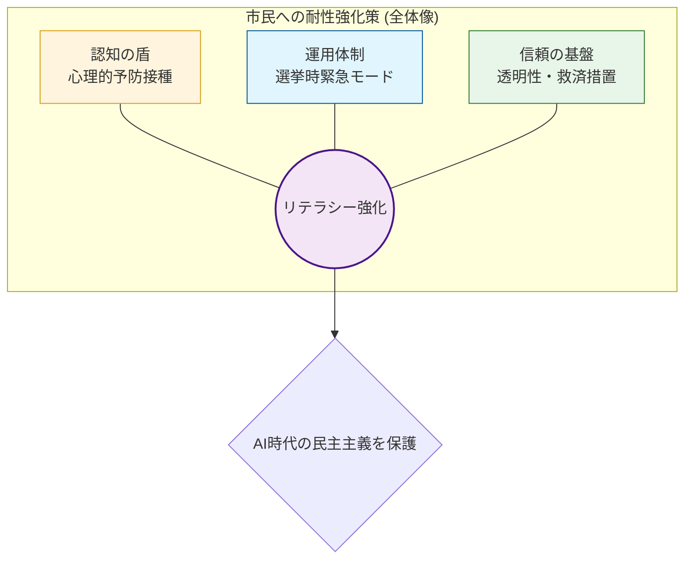

# 問六⑶ 市民への耐性強化策：画像生成用プロンプト（日本語版）

このYAMLブロックを、画像生成AI（DALL-E 3、Midjourney等）に入力してください。
⑶のmdファイルで定義した「3つの防衛策」を1枚にまとめたコンセプト図を生成します。

```yaml
target_image:
  subject: "A professional infographic diagram for '市民のリテラシー向上によるAI世論操作防衛策'"
  style: "Clean, modern, educational infographic, friendly but serious atmosphere"
  layout: "Circular or Grid layout showing three key pillars"
  language: "Japanese (Mandatory: All labels in Japanese)"

pillar_labels:
  1. Pillar_Prebunking: "心理的予防接種 (プレバンキング) - 攻撃パターンの早期疑似体験"
  2. Pillar_Emergency: "選挙時緊急運用体制 - プラットフォーム・政府・報道のリアルタイム連携"
  3. Pillar_Transparency: "透明性の確保 - 修正根拠の開示とユーザー救済プロトコル"

visual_elements:
  icons: "Golden Shield, Lighthouse (truth), Educational video icon, Handshake (trust)"
  colors: "Trust Blue, Hope Green, Soft Orange"
  background: "Clean light background"

technical_directives:
  - "Write all labels in clear, legible Japanese characters"
  - "The diagram should feel empowering and focused on 'Citizen Resilience' (市民の耐性)"
  - "Use simple, recognizable icons for each of the three pillars"
  - "High quality, sharp vectors, and professional layout"
```

---

### 💡 確実な図表作成（Mermaidコード：日本語版）
画像内の文字化けを避けたい場合は、こちらのMermaidコードを使用してください。


